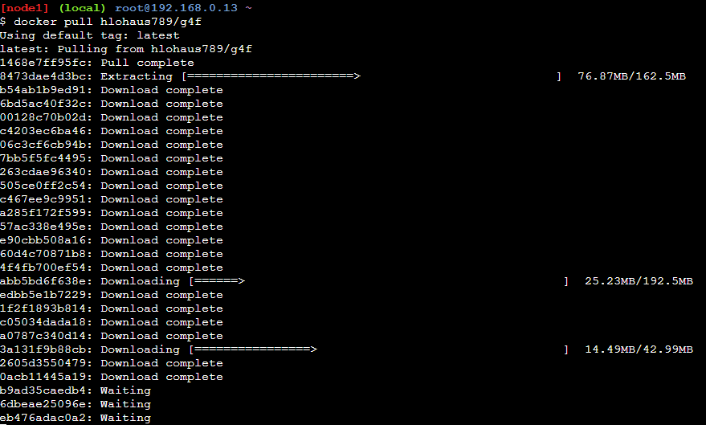
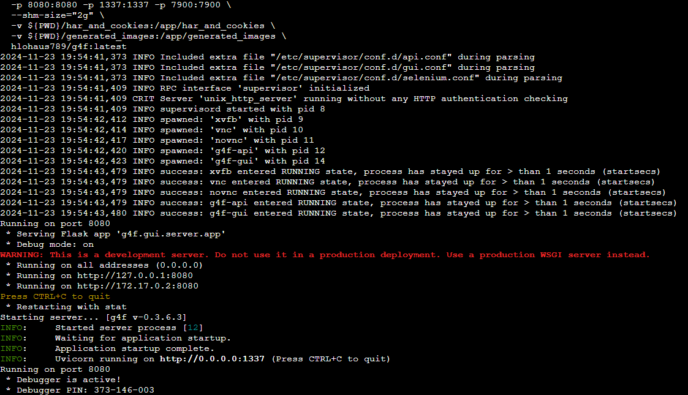
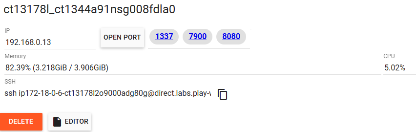
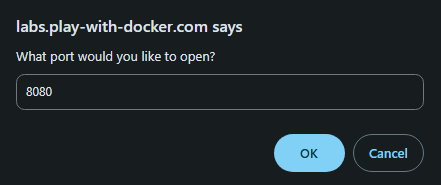
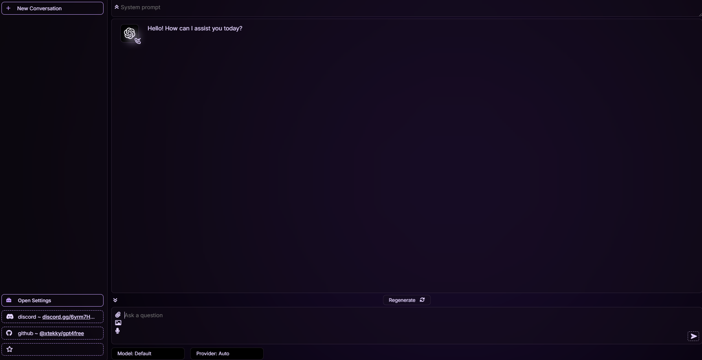

# GPT4Free Execution Guide

This guide explains how to set up and run the **GPT4Free** project. **GPT4Free** claims to offer free access to GPT models by tricking GPT vendors into processing requests as if they are from authorized accounts. However, please be aware of the following:

⚠️ **Legal Disclaimer:** Using GPT4Free may violate laws or terms of service. I do not endorse or encourage its use. Proceed at your own risk.

> *Note:* This guide is accurate as of **November 23, 2024**, and will not be updated. Please refer to the original repository for the latest instructions.

---

## How to Use GPT4Free

There are two ways to run GPT4Free: 

### 1. **Using Python and pip**

#### Prerequisites:
- Python installed (e.g., Python 3.9+)
- A virtual environment set up

#### Steps:
1. Set up a virtual environment:
   ```bash
   python3 -m venv venv
   source venv/bin/activate
   ```

2. Install GPT4Free:
   ```bash
   pip install -U g4f[all]
   ```

3. Test the GPT model in a Python script or notebook:
   ```python
   from g4f.client import Client

   client = Client()
   response = client.chat.completions.create(
       model="gpt-4o-mini",
       messages=[{"role": "user", "content": "Hello"}]
   )
   print(response.choices[0].message.content)
   ```

#### Available Models:
- `gpt-4o-mini`
- `gpt-4o`
- `gpt-4`

---

#### **My Experience with the Python Approach**
1. **It works!** The project can provide access to GPT models.
2. **Inconsistent response times:** 
   - Sometimes responses are near-instant.
   - Other times, it takes minutes or fails entirely. Retrying usually works.
3. **Limitations:**
   - Couldn’t process images with vision models (`gpt-4o-mini` or `gpt-4o`).
   - Couldn’t use the `flux` model for image generation.
   - Parameter settings like `temperature` don’t seem to work. They always default to the model's settings even if you try to change them.

---

### 2. **Using the Docker-based Chatbot UI**

This method provides a chatbot interface where you can connect your own API keys. Based on my experience, this does not give free GPT access but offers a user-friendly UI.

#### Steps:
1. Use [Play with Docker](https://labs.play-with-docker.com/) (no local installation needed):
   - Log in with a Docker account and start an instance.
   - Add a new instance and run the following commands:

2. Pull the Docker image:
   ```bash
   docker pull hlohaus789/g4f
   ```
    

3. Run the Docker image:
   ```bash
   docker run \
     -p 8080:8080 -p 1337:1337 -p 7900:7900 \
     --shm-size="2g" \
     -v ${PWD}/har_and_cookies:/app/har_and_cookies \
     -v ${PWD}/generated_images:/app/generated_images \
     hlohaus789/g4f:latest
   ```
    

4. Access the UI:
    - Open port `8080` on the Docker instance by clicking the **Open PORT** button.  
    > *If your browser blocks the pop-up, allow it as a one-time exception.*

    - A new browser window will open. Use this window to access the chatbot UI.
    
    

5. Configure the UI:
   - Add your API key in the **Settings**.
   - Select your desired model and provider from the dropdown menu.
   

---

#### **My Experience with the Docker Approach**
- I couldn’t interact with GPT models for free using this method.
- However, the UI works well for managing your own API keys, as reported by others.

---

## References
- [GPT4Free GitHub Repository](https://github.com/xiangsx/gpt4free-ts)
- [GPT4Free playground](https://gpt4free.io/)
- [TechCrunch Article on GPT4Free](https://techcrunch.com/2023/04/25/a-developer-exploited-an-api-flaw-to-provide-free-access-to-gpt-4/)

---

**Note:** Always verify the legality and terms of use before proceeding with projects like GPT4Free.